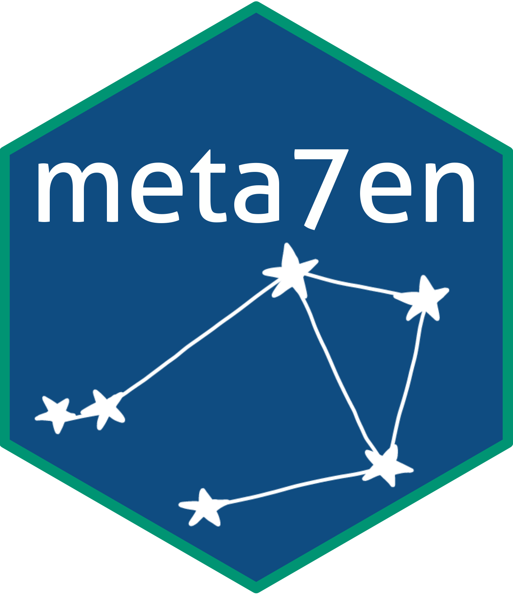
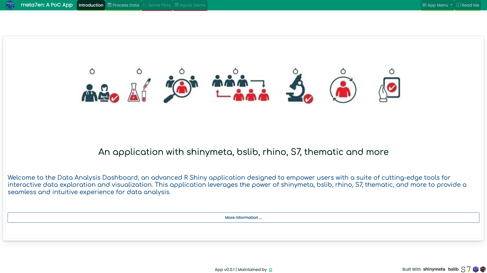

<!-- badges: start -->

<!-- badges: end -->

# meta7en

### A { bslib } ~ { rhino } Application
### Built with { shinymeta } and { S7 } classes

## Overview

meta7en is an R Shiny application showcasing the synergy of { S7 } classes, { shinymeta }, { bslib }, and { rhino }. This combination delivers a cutting-edge, robust, scalable, user-friendly, and themed application. It leverages modularity and theming to provide a fast and pleasant user experience.

## Key Features

### Brands, Colors, and Themes

- Centralized Color Management: All colors in the app stem from a single source, ensuring consistency across elements.

- Easy Theming: Changing color definitions updates all elements, including cards, shiny inputs, headers, dropdowns, plots, tables, and icons, maintaining a cohesive theme.

- Customization: While the app has a unified theme, it remains customizable for specific needs.

### Database connections

- { S7 } Class for Database Management: Utilizing an { S7 } class for database management offers several advantages:

- Transactional Integrity: Transactions with a pool are managed, ensuring all SQL queries either fully execute or none do.

- Secure Password Handling: Passwords are stored in a .Renviron file, safeguarding them from exposure in R code.

- Safe SQL Query Execution: Queries are wrapped in `glue_sql()`, preventing SQL injection vulnerabilities.

- Efficient Resource Usage: The pool is generated at app start and used throughout, preventing leaks.

### Extracting source code

Extracting the code leading to a specific output can be challenging if not designed properly from the start. 

- Thats why we are using { shinymeta } to make this process easy, modular and reproducible. In this app, we have a { DT } table showing a data that can be modified. 

- The modifications are in separate modules and { shinymeta } is able to track this and extract the source code.

- To achieve this, we are using { shinymeta } reactive statements like `metaReactive`, `metaObserve` in place of `reactive` and `observeEvent` from { shiny }.

### Framework

We are using { rhino }, but modified the structure to fit use cases of source code and themes. We are using { box } to import any modules to the application. { renv } is used for managing R dependencies.

### Docker

Coming soon.

## Additional Notes

- Modular Design: Easily extendable with new functionality by creating additional logic and UI modules.

- Bookmarking: Users can save and restore their application state.

- Documentation: This README.md is view able within the application under the "Read Me" tab, providing users with valuable information.

- Feedback: We appreciate your usage of our web application! For questions or feedback, please reach out to the development team.
